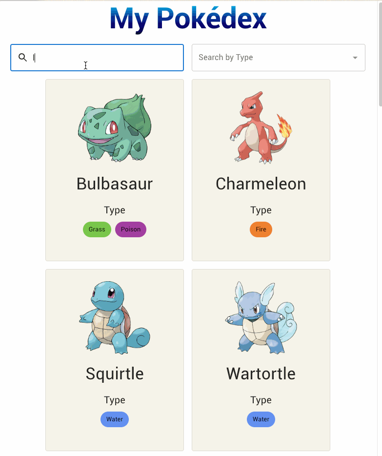

# Pokédex Revamped

## Introduction

The goal is to create a new Pokédex which can be from a mobile phone or desktop. You can check it out here: https://pokedex-revamped.web.app/

This project was bootstrapped with [Create React App](https://github.com/facebook/create-react-app).

## Features

- Ability to search for a Pokémon by name
- Ability to filter Pokémon by types

## Future Improvements

- Loading the entire list of Pokémon is a bit cumbersome. Given a backend service, we could implement cursor pagination to load the list of Pokemon in batches when the user reaches the bottom of the screen. Right now, we're loading all the components of the Pokémon list at once with some optimization in lazy loading the images.
- Filter and search functionaity would be faster if it was moved to the service layer
- Skeleton loading for the pokemon cards instead of one big loading spinner
- Better visual design for the Pokémon cards, maybe some interactivity leading to a modal with more details about the HP, attack, defense, etc.
- End to end testing with Cypress or another alternative to test for specific user flows
- Set up automatic deployments with CircleCI upon merging to the main branch

## Tech Stack

- React
- Material UI
- Firebase Hosting
- Jest

---

## Available Scripts

In the project directory, you can run:

### `npm start`

Runs the app in the development mode.\
Open [http://localhost:3000](http://localhost:3000) to view it in the browser.

The page will reload if you make edits.\
You will also see any lint errors in the console.

### `npm test`

Launches the test runner in the interactive watch mode.\
See the section about [running tests](https://facebook.github.io/create-react-app/docs/running-tests) for more information.

### `npm run build`

Builds the app for production to the `build` folder.\
It correctly bundles React in production mode and optimizes the build for the best performance.

The build is minified and the filenames include the hashes.\
Your app is ready to be deployed!

See the section about [deployment](https://facebook.github.io/create-react-app/docs/deployment) for more information.

### `npm run eject`

**Note: this is a one-way operation. Once you `eject`, you can’t go back!**

If you aren’t satisfied with the build tool and configuration choices, you can `eject` at any time. This command will remove the single build dependency from your project.

Instead, it will copy all the configuration files and the transitive dependencies (webpack, Babel, ESLint, etc) right into your project so you have full control over them. All of the commands except `eject` will still work, but they will point to the copied scripts so you can tweak them. At this point you’re on your own.

You don’t have to ever use `eject`. The curated feature set is suitable for small and middle deployments, and you shouldn’t feel obligated to use this feature. However we understand that this tool wouldn’t be useful if you couldn’t customize it when you are ready for it.
